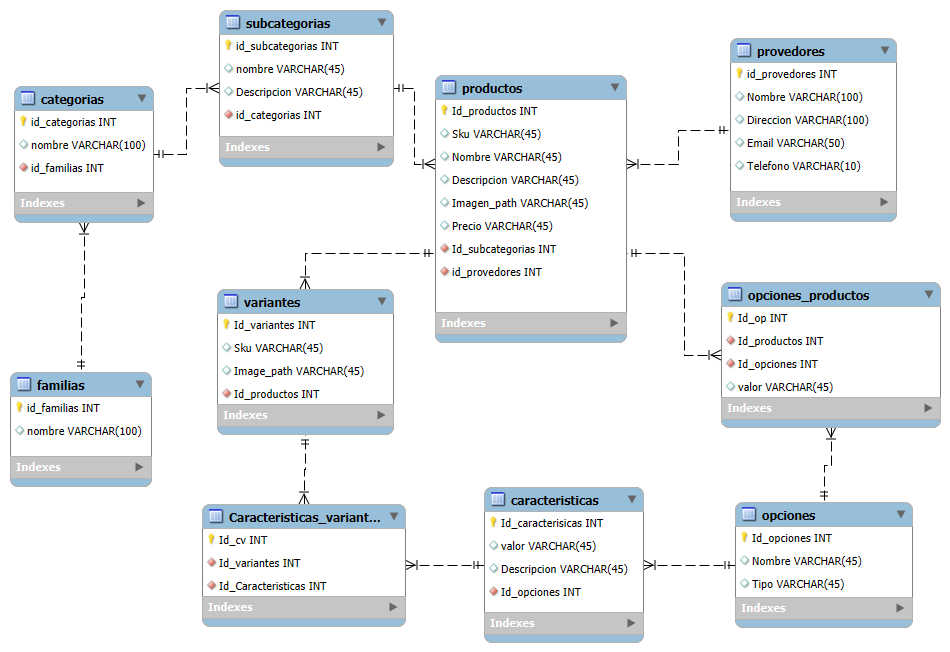

# Sistema de Gestión de Inventario y Catálogo

Este proyecto es un sistema completo de gestión de inventario y catálogo que incluye autenticación avanzada, gestión de categorías, proveedores, variantes, productos e inventario.

## Requisitos del Sistema

- PHP >= 8.2
- Composer
- Node.js >= 16.x
- NPM >= 8.x
- MySQL

## Instalación

Siga estos pasos para configurar el proyecto:

1. Clone el repositorio
```bash
git clone https://github.com/Conie14/Tienda_prueba.git
cd repositorio
```

2. Instale las dependencias de PHP
```bash
composer install
```

3. Instale las dependencias de Node.js
```bash
npm install
```

4. Configure el archivo de entorno
```bash
cp .env.example .env
php artisan key:generate
```

5. Configure su base de datos en el archivo `.env`
```
DB_CONNECTION=mysql
DB_HOST=127.0.0.1
DB_PORT=3306
DB_DATABASE=nombre_base_datos
DB_USERNAME=usuario
DB_PASSWORD=contraseña
```

6. Configure las variables para el envío de correos (para confirmación de registro y recuperación de contraseña)
```
MAIL_MAILER=smtp
MAIL_HOST=smtp.mailtrap.io
MAIL_PORT=2525
MAIL_USERNAME=username
MAIL_PASSWORD=password
MAIL_ENCRYPTION=tls
MAIL_FROM_ADDRESS=from@example.com
MAIL_FROM_NAME="${APP_NAME}"
```

7. Ejecute las migraciones y seeders
```bash
php artisan migrate:fresh --seed
```

8. Compile los assets
```bash
npm run dev
```

9. Inicie el servidor
```bash
php artisan serve
```

La aplicación estará disponible en `http://localhost:8000`

## Estructura del Proyecto

El proyecto sigue una arquitectura limpia con separación de responsabilidades:

```
├── app/
│   ├── Http/
│   │   ├── Controllers/     # Controladores de la aplicación
│   │   ├── Middleware/      # Middleware para autenticación y roles
│   │   └── Requests/        # Validación de formularios
│   ├── Models/              # Modelos Eloquent
│   ├── Repositories/        # Implementación del patrón repositorio
│   ├── Services/            # Lógica de negocio
│   └── Events/              # Eventos y listeners
├── database/
│   ├── migrations/          # Migraciones de la base de datos
│   └── seeders/             # Datos de prueba
├── resources/
│   ├── js/                  # Código frontend (React)
│   └── views/               # Plantillas blade (si aplica)
└── tests/                   # Pruebas automatizadas
```

## Módulos del Sistema

El sistema incluye los siguientes módulos:

1. **Autenticación y Autorización**
   - Registro con validación y confirmación por email
   - Login/logout
   - Sistema de roles

2. **Gestión de Categorías**
   - CRUD completo con soporte para subcategorías
   - Vista de árbol para categorías anidadas
   - Búsqueda avanzada

3. **Gestión de Proveedores**
   - CRUD completo
   - Validación de datos de contacto

4. **Gestión de Variantes y Tipos de Variante**
   - Sistema flexible para definir variantes (ej. talla, colores, sexo)
   - Asociación de tipos de variante a variantes

5. **Catálogo de Productos**
   - Productos simples y con variantes
   - Imagenes por producto
   - Categorización y filtros
   - Exportación a Excel/CSV

## Diagrama Entidad-Relación



## Ejecutando Pruebas

Para ejecutar las pruebas automatizadas:

```bash
php artisan test --env=testing
```

Asegúrese de tener una base de datos de pruebas configurada en su archivo `.env.testing`:

```
DB_CONNECTION=mysql
DB_HOST=127.0.0.1
DB_PORT=3306
DB_DATABASE=tienda
DB_USERNAME=root
DB_PASSWORD=
```

## Comandos Útiles de Desarrollo

```bash
# Compilar assets para desarrollo
npm run dev

# Compilar assets para producción
npm run build

# Limpiar caché
php artisan cache:clear

# Generar modelos y migraciones
php artisan make:model NombreModelo -m

# Ejecutar trabajos en cola
php artisan queue:work
```

## Licencia

Este proyecto está bajo la licencia MIT.